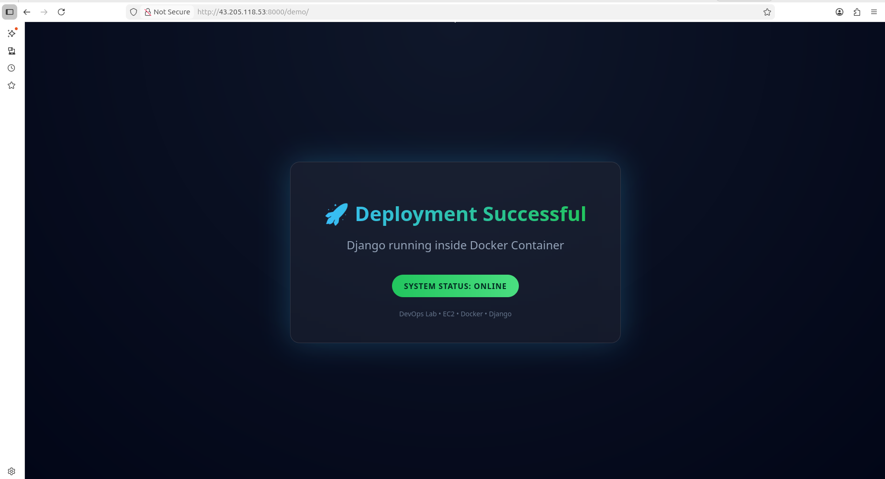
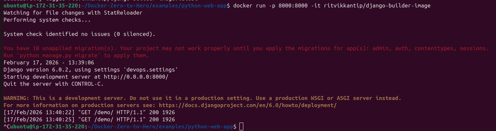

# 🐳 Django Application – Production-Style Containerized Deployment  
### Docker • Kubernetes • AWS EC2 • Terraform • DevOps

<p align="center">
  
  
  
  
  
  
</p>

---

## 📌 Overview

This project demonstrates the evolution of a Django application from:

- Local development  
- Docker containerization  
- AWS EC2 deployment  
- Infrastructure automation using Terraform  
- Kubernetes-based production-style orchestration  

The goal was not just to run a container, but to deploy and manage an application using modern DevOps practices.

<p align="center">
  
</p>

---

# 🐳 Docker Implementation

## Why Containers?

Containers package the application along with its dependencies, making deployments consistent across environments.

### Containers vs Virtual Machines

1. Containers share the host OS kernel → lightweight & fast  
2. VMs require a full OS + hypervisor → resource intensive  
3. Containers are highly portable  
4. VMs provide stronger isolation  

### Why Containers Are Lightweight

Containers share the host kernel and only include necessary runtime dependencies.

Example:

Official Ubuntu base image (~22 MB) vs Ubuntu VM image (~2.3 GB).


---

## Docker Architecture


Docker Daemon (dockerd) manages images, containers, networks, and volumes.

---

## Docker Lifecycle

1. docker build  
2. docker run  
3. docker push  


---

## Build & Push Image

```bash
docker build -t ritvikkantip/python-web-app:v1 .
docker push ritvikkantip/python-web-app:v1
```

Verify:

```bash
docker images
```

<p align="center">
  
</p>

Run:

```bash
docker run -p 8000:8000 ritvikkantip/python-web-app:v1
```

<p align="center">
  
</p>

Push Output:

<p align="center">
  
</p>

---

# ☁️ Infrastructure Provisioning (Terraform)

Infrastructure was provisioned using Terraform to automate:

- EC2 instance creation  
- Networking configuration  
- Security groups  

This ensured reproducibility and eliminated manual provisioning.

---

# ☸️ Kubernetes Deployment (Production-Style Upgrade)

Minikube was used as a sample Kubernetes cluster.

---

## Deployment Configuration

```yaml
apiVersion: apps/v1
kind: Deployment
metadata:
  name: python-deployment
spec:
  replicas: 2
  selector:
    matchLabels:
      app: sample-python-app
  template:
    metadata:
      labels:
        app: sample-python-app
    spec:
      containers:
      - name: sample-python-app
        image: ritvikkantip/python-web-app:v1
        ports:
        - containerPort: 8000
```

Apply:

```bash
kubectl apply -f deployment.yml
```

---

## Service Configuration

```yaml
apiVersion: v1
kind: Service
metadata:
  name: python-deployment-service
spec:
  type: NodePort
  selector:
    app: sample-python-app
  ports:
    - port: 80
      targetPort: 8000
      nodePort: 30007
```

Apply:

```bash
kubectl apply -f service.yml
```

Traffic Flow:

External Client → NodePort → Service → Pod

---

# 🔍 Debugging & Service Discovery

Initially, NodePort was unreachable.

Diagnosis:

```bash
kubectl get endpoints
```

Returned `<none>`.

Root Cause:
Service selector did not match Deployment labels.

Fix:
Aligned labels → endpoints registered → traffic restored.

Key Insight:
Kubernetes Services are entirely label-driven.

---

# 📊 Observability with Kubeshark

Used Kubeshark to:

- Monitor real-time Service-to-Pod traffic  
- Observe load balancing across replicas  
- Validate traffic distribution  

This confirmed requests were evenly distributed across pods.

---

# 🏗 Production Considerations

Minikube was used for development.

In a real organizational environment:

- Multi-node cluster provisioned using KOPS  
- LoadBalancer or Ingress for controlled exposure  
- CI/CD integration  
- Secure secret management  
- Proper networking & IAM configuration  

---

# 🎯 Key Learnings

- Containerization ensures portability  
- Deployments enable scalability & rolling updates  
- Services rely strictly on label-selector matching  
- `kubectl get endpoints` is critical for debugging  
- Observability validates behavior beyond YAML  

---

# 📬 Conclusion

This project reflects a transition from:

Single Docker container  
→ Infrastructure automation  
→ Orchestrated Kubernetes workload  
→ Production-style deployment architecture
